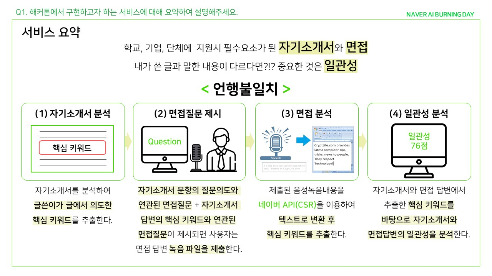
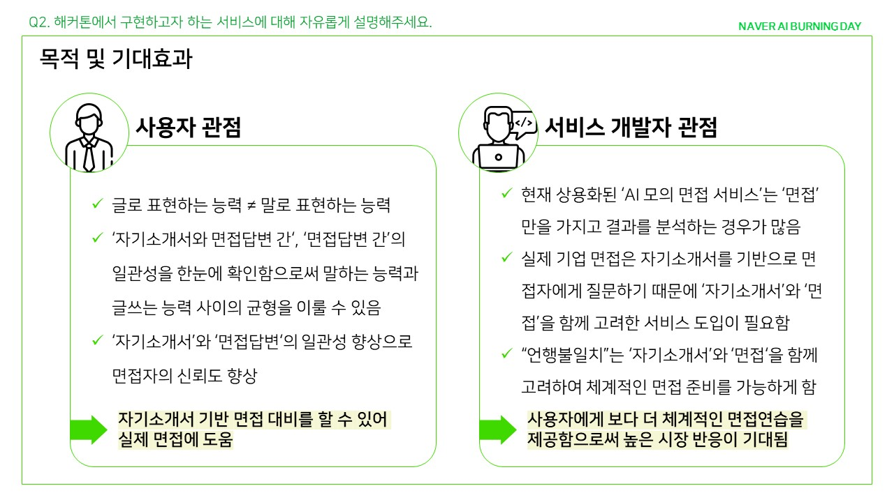
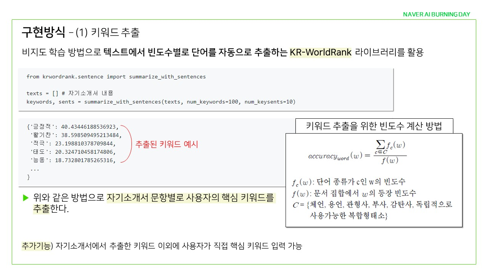
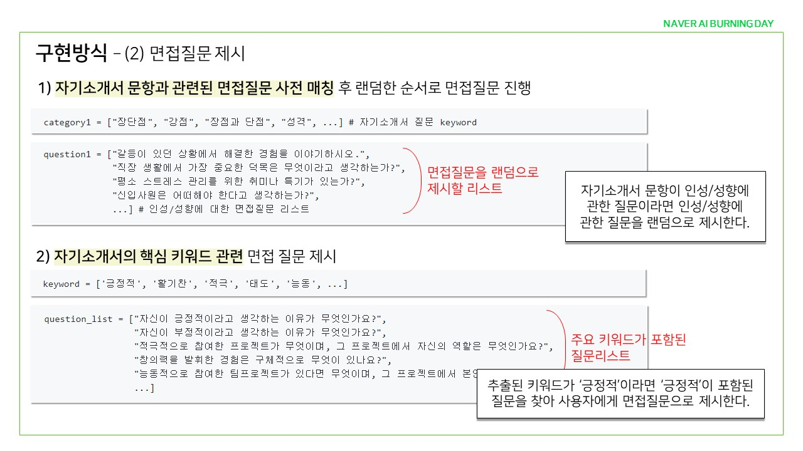
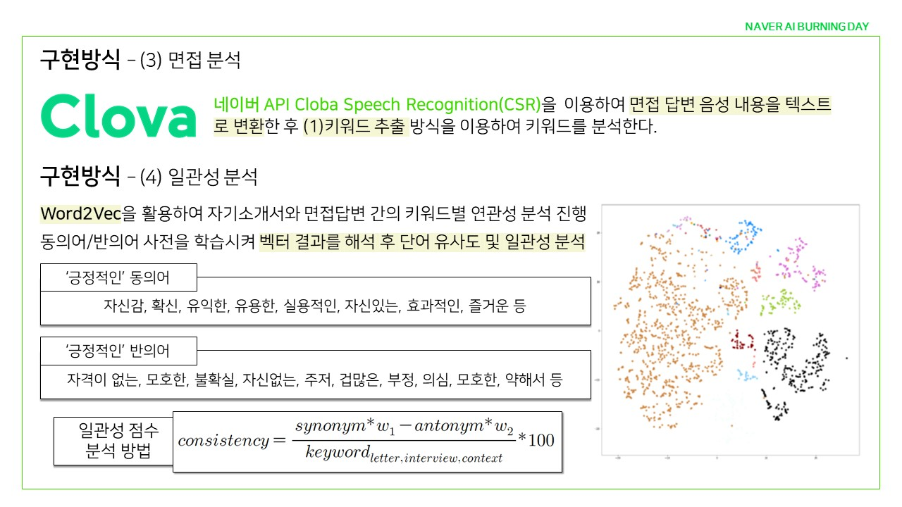
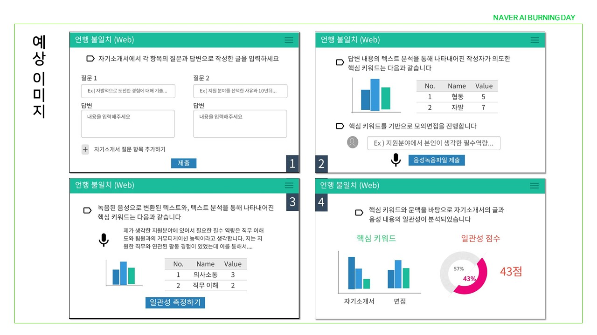

# [Naver AI Burning Day][https://campaign.naver.com/aihackathon_ai_burning/]

AI를 응용한 개발 미션을 갖고 다른 사람들과 함께 고민하고 해결하는 자리

#### Mission

[네이버 클라우드 플랫폼 AI API][https://www.ncloud.com/product/aiService]를 활용한 앱 또는 웹 개발

#### 심사기준

- 독창성 (30%) : 얼마나 독창적인 기술 혹은 아이디어인가
- 기술성 (50%) : 기술구현에 있어서 얼마나 난이도가 있는가
- 프로젝트 운영 (20%) : 얼마나 체계적으로 구성하여 개발을 진행하는가

서비스의 완성도 보다는 프로젝트 **기술 완성도**를 중점적으로 평가합니다.

#### 일정

1. **참가신청**
   일정 : ~2020/1/20

   참가팀 및 팀원 지원서 접수

   참가 신청해주신 모든 지원자의 서류 및 지원서를 검토합니다.

2. **예선**
   일정 : 2020/1/21~1/31

   약 2주간 코딩테스트 및 기획안 제출

   코딩테스트 결과 및 기획안 검토를 통하여 본선 진출팀(30팀) 선발

   결과 발표 : 2020/2/5 (개별안내)

3. **본선(2박 3일)**
   일정 : 2020/2/13~2/15

   2박 3일간 춘천 네이버 커넥트원에서 진행

   현장에서 해커톤 진행, 심사위원 평가 및 시상이 진행

#### Award

- 1등: 500만원
- 2등: 300만원
- 3등: 200만원

우수 참가자 중 네이버 클로바 및 네이버클라우드플랫폼 입사 개발 직군 지원 시, 서류전형 면제(6개월 이내 지원 시)본선 진출자에게는 티셔츠 및 기념품 증정

 

---

 

## 인공지능 기술

#### Clova Speech Recognition(CSR)

사람의 목소리를 텍스트로, 다양한 음성 인식 서비스에 활용

#### Clova Speech Synthesi(CSS)

입력한 텍스트를 자연스러운 목소리로 재생, 음성 합성 API

#### Clova Face Recognition(CFR)

이미지 속의 얼굴을 감지하고 인식하여 얻은 다양한 정보 제공

#### Clova Premium Voice(CPV)

사람같은, 고품질의 합성음 제공

#### Chatbot

사용자의 질문의도를 이해하여 고객 대응하는 서비스에 활용

#### [OCR][https://www.ncloud.com/product/aiService/ocr]

인쇄물 상의 글자와 이미지를 디지털 데이터로 자동 추출

#### Papago NMT

입력한 텍스트를 인공신경망 기반 번역 알고리즘을 통해 여러 나라 언어로 자동 번역

#### Papago Korean Name Romanizer

현행 로마자 표기법에 맞춰 한글 이름을 로마자로 변환

#### TensorFlow Server

#### TesorFlow Cluster

#### Pose Estimation

이미지 속의 사람을 감지하고 몇 명이 어떤 포즈를 취하고 있는지에 대한 좌표 정보 얻을 수 있음

#### Object Detection

이미지 내 사람 및 자동차 등 객체의 타입과 위치를 감지하여 정보 제공

#### 제안 기획서

[https://campaign.naver.com/aihackathon_ai_burning/]: https://campaign.naver.com/aihackathon_ai_burning/
[https://www.ncloud.com/product/aiService]: https://www.ncloud.com/product/aiService
[https://www.ncloud.com/product/aiService/ocr]: https://www.ncloud.com/product/aiService/ocr
