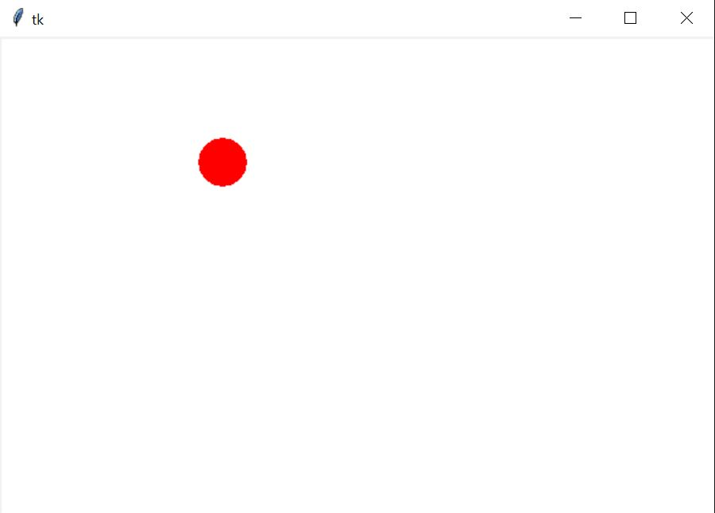
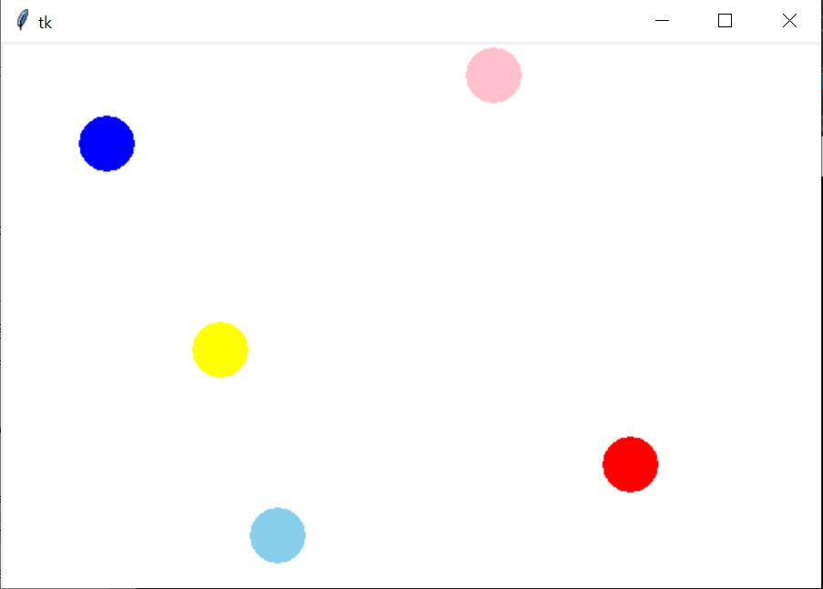
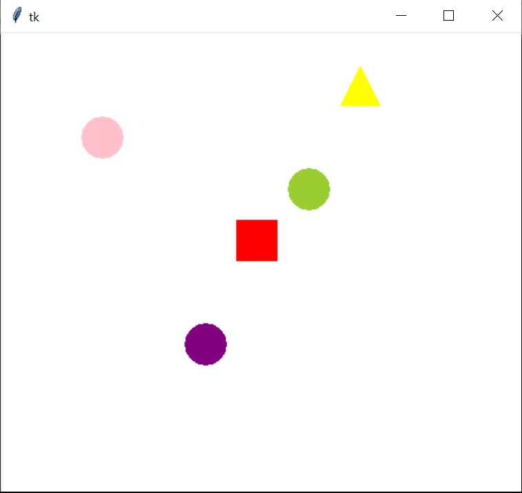
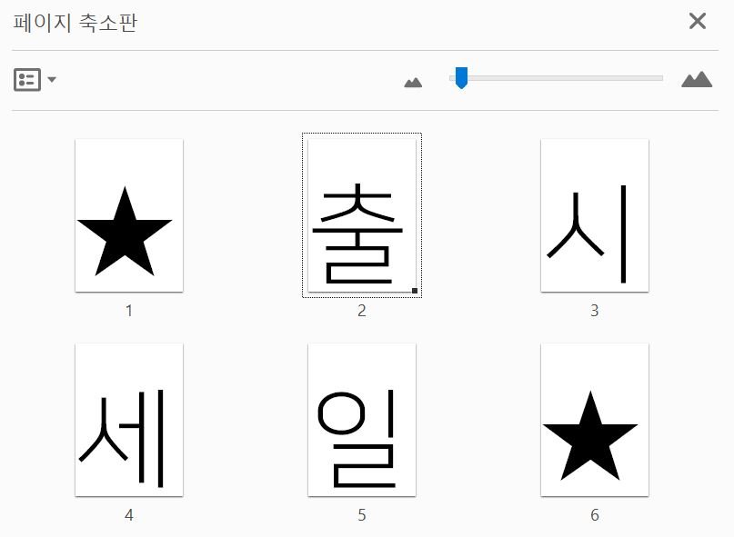

# Canvas Description

### ClickBall
클릭하면 공이 생기는 프로그램입니다. 
 

 
### ReflectBall
벽에 공이 닿으면 공이 튕겨나가는 프로그램입니다. 
 

 
### UseClassAndObject
클래스와 객체 개념을 사용했습니다. 여러 도형을 객체를 통해 많이 생성할 수 있으며, 같은 동작을 수행할 수 있습니다. 또한, 기존의 원이 아닌 다른 도형은 상속을 통해 작동할 수 있습니다. 
 

 
### CreatePDF
문구를 입력하면 그 문구를 PDF로 만들어 플랜카드를 인쇄하기 쉽도록 하는 프로그램입니다. 
 
